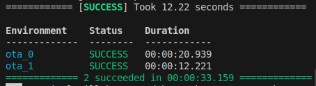

# dual-boot-ESP32-PlatformIO-Arduino

This repository shows the simplest way to setup a dual boot on ESP32 using PlatformIO.
With this method it is possible to upload two different applications on a single ESP32 and switch between them using a GPIO pin. 

Actually, it is possible to upload more than two applications on the same ESP32. For more detailed infos [Epressif - Partition Table](https://docs.espressif.com/projects/esp-idf/en/stable/esp32/api-guides/partition-tables.html).

**Note**: This repository uses the same code for both the partitions, differenciating the functionalities using two macros ```OTA_0``` and ```OTA_1``` defined in the ```platformio.ini```, but it is also possible to upload different files.

## Explanation

### ```partition.csv```
In order to have two partitions on the same ESP32 must be created a file ```partitions.csv``` that specify the type and the dimensions of each partition. This code uses the following partition table: 

```
# Name,   Type, SubType, Offset,  Size, Flags
nvs,      data, nvs,     0x9000,  20k,
otadata,  data, ota,     0xe000,  8k,
ota_0,    app,  ota_0,   0x10000, 1M,
ota_1,    app,  ota_1,   0x110000,1M,
coredump, data, coredump,,64k,
```

- ```ota_0```: is the first partition, which starts at the ```0x10000``` address of memory;
- ```ota_1```: is the second partition, which starts at the ```0x110000``` adress of memory.
- 
Both the partitions are 1M of memory. Note that **the address depends on the size of the partition**, so be carefull to change both this values in accordance.

### ```platformio.ini```
The ```plaformio.ini``` should be set in the following way:

```
[platformio]

[common]
platform = espressif32
board = esp32dev
framework = arduino
upload_port = /dev/ttyUSB0
monitor_speed = 115200
board_build.partitions = partitions.csv

[env:ota_0]
extends = common
board_upload.offset_address = 0x10000
build_flags = -D OTA_0

[env:ota_1]
extends = common
board_upload.offset_address = 0x110000
build_flags = -D OTA_1
```

where:
- ```common```:
  - ```plaform```: is the framework of the ESP32 platform
  - ```board```: is the type of the board 
  - ```framework```: is the type of the framework used for this project (in this case Arduino)
  - ```upload_port```: is the port of the computer used to upload the firmware on ESP32 (use the command ls /dev/tty* to check the port at which the ESP32 is connected to)
  - ```monitor_speed```: the baud ratio of the serial communication
  - ```board_build.partitions```: the file that describe the partition table
- ```env:ota_0```
  - ```extends```: specify which enviroment is extended
  - ```board_upload.offset_address```: specify which is the address at which starts this partition. This address must match the one specified in the ```partition.csv``` for the same partition.
  - ```build_flags```: it is used to create a macro ```OTA_0```, which is defined exclusivly for this partition. This macro is then used to differenciate the code used for the first application. 
- ```env:ota_1```
  - ```extends```: specify which enviroment is extended
  - ```board_upload.offset_address```: specify which is the address at which starts this partition. This address must match the one specified in the ```partition.csv``` for the same partition.
  - ```build_flags```: it is used to create a macro ```OTA_1```, which is defined exclusivly for this partition. This macro is then used to differenciate the code used for the second application. 

Using the macros ```OTA_0``` and ```OTA_1``` it is possible to reuse the same code for multiple applications, by differenciating small portions of code with the construct:
```c
#ifdef OTA_0
...
#endif

#ifdef OTA_1
...
#endif
```

Otherwise, it is also possible to upload different files on each partition, using the follwing option in the ```platformio.ini```:
- ```build_src_filter = +<filename_1> -<filename_2>```


### ```app.h```

In the ```app.h``` are defined the following macros:
- ```SWITCH_PARTITION_PIN```: is the GPIO pin used to switch between the two applications, by directly connecting or disconnecting it to GND.
- ```PARTITION_TYPE```: is the type of the partition specified in the ```partition.csv```.
- ```SWITCH_PIN_STATE```: is the state of the ```SWITCH_PARTITION_PIN``` (```low``` if connected two GND, ```high``` otherwise).


```c
#define SWITCH_PARTITION_PIN 16

#ifdef OTA_0
#define PARTITION_TYPE ESP_PARTITION_SUBTYPE_APP_OTA_1
#define SWITCH_PIN_STATE LOW
#endif

#ifdef OTA_1
#define PARTITION_TYPE ESP_PARTITION_SUBTYPE_APP_OTA_0
#define SWITCH_PIN_STATE HIGH
#endif
```


## Usage
### Clone the repository
```
git clone https://github.com/ValerioSpagnoli/Dual-Boot-ESP32.git
```

### PlatformIO
Use the VS Code extention Platformio to setup the project and upload the firmware.
If the firmware will be uploaded successfully you should see something like that:



### Run
Once the firmware is uploaded on the ESP32 open the serial monitor and use a FF jumper to connect and disconnect the ```SWITCH_PARTITION_PIN``` to GND in order to switch between the two applications.